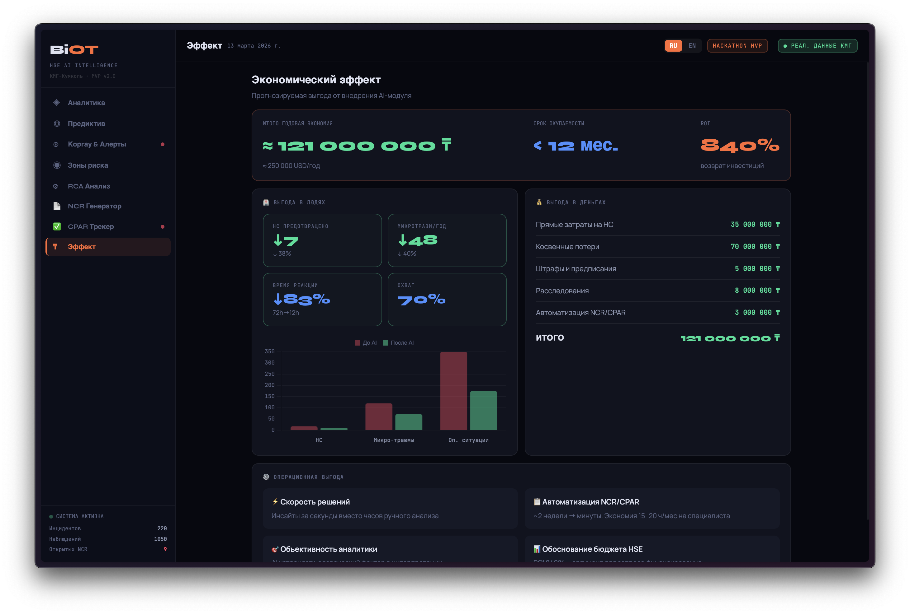

<!-- Language toggle -->
<div align="right">
  <a href="#ru">🇷🇺 Русский</a> &nbsp;|&nbsp;
  <a href="#en">🇬🇧 English</a>
</div>

---

<div id="ru"></div>

# 🛡️ BiOT — HSE AI Intelligence

> **B**ehavioral **I**ntelligence for **O**ccupational Safety **T**echnology  
> *Аналитический AI-модуль для управления безопасностью труда*

[](.)
[](.)
[](.)
[](.)

---

## 📋 Навигация

- [Описание проблемы](#-описание-проблемы)
- [Решение](#-решение-biot)
- [AI-составляющая](#-ai-составляющая)
- [Выполнение требований ТЗ](#-выполнение-требований-тз)
- [Функционал — 8 страниц](#-функционал--8-страниц)
- [Экономический эффект](#-экономический-эффект)
- [Технологии](#-технологии)
- [Быстрый старт](#-быстрый-старт)
- [Словарь терминов](#-словарь-терминов)

---
## 📋 Демо-версия

Демо-версия MVP доступна по ссылке 👉🏻 [открыть демо](https://biot-hse-ai.netlify.app/) 


---
## 🔴 Описание проблемы

В ТОО «КМГ-Кумколь» управление охраной труда сегодня **реактивное**:

```
Инцидент произошёл
      ↓
Расследование (72+ часов)
      ↓
Ручное составление NCR¹ (до 2 недель)
      ↓
CPAR² назначен ответственному
      ↓
Контроль вручную, риск просрочки
```

**Ключевые боли:**

- HSE³-специалисты тратят **15–20 часов в месяц** на ручной анализ данных
- Каждый ЛТИ⁴ обходится компании **от 5 до 35 млн ₸** (прямые + косвенные потери)
- Данные ИСОТ⁵ не анализируются системно — паттерны рисков выявляются постфактум
- Корреляция между нарушениями (Карта Коргау⁶) и будущими инцидентами не отслеживается
- Near miss⁷ регистрируются, но не используются для предиктивного анализа

---

## 💡 Решение — BiOT

**BiOT** — AI-аналитический слой поверх двух модулей ИСОТ, переводящий исторические данные в **проактивный инструмент предотвращения инцидентов**.

```
        Исторические данные ИСОТ
    ┌──────────────┬──────────────┐
    │  Происшествия│  Карта Коргау│
    │  220 записей │ 1050 записей │
    └──────┬───────┴──────┬───────┘
           └──────┬────────┘
                  ↓
           AI-модуль BiOT
    ┌─────────────────────────────────┐
    │ Risk Scoring  → индекс 0–100   │
    │ Time Series   → прогноз 12 мес │
    │ Correlation   → нарушения→инц  │
    │ Alert Engine  → 4 уровня       │
    │ RCA⁸          → дерево причин  │
    │ NCR Generator → черновик < 1мин│
    │ CPAR Tracker  → % выполнения   │
    └─────────────────────────────────┘
                  ↓
    Проактивное управление безопасностью
    (меры ДО инцидента, не после)
```

### Почему название BiOT?

**B**ehavioral **I**ntelligence for **O**ccupational Safety **T**echnology

- **Behavioral** — в основе лежит анализ поведенческих данных (Карта Коргау⁶, Near Miss⁷)
- **Intelligence** — система не просто хранит данные, а извлекает из них знания (AI-аналитика)
- **Occupational Safety** — международный стандартный термин для охраны труда (=HSE³, OT)
- **Technology** — технологическое решение, а не консалтинг или методология

---

## 🤖 AI-составляющая

BiOT реализует **Explainable AI⁹** — объяснимый искусственный интеллект. Это осознанный выбор: в нефтегазовой отрасли регуляторы и аудиторы требуют, чтобы каждое решение системы можно было объяснить и обосновать.

### Компонент 1 — Risk Scoring Model

Система одновременно анализирует **8 факторов риска** и рассчитывает взвешенный индекс от 0 до 100:

| Фактор | Влияние |
|---|---|
| Тяжесть инцидента | Основной компонент (высокий вес) |
| Время суток (ночная смена) | Повышающий коэффициент |
| Погодные условия | Ситуационный фактор |
| Соблюдение требований СИЗ¹⁰ | Поведенческий индикатор |
| Опыт работника | Профессиональный фактор |
| Опасные ситуации (near miss⁷) за 30 дней | Опережающий индикатор |
| Актуальность обучения и инструктажа | Организационный фактор |
| Тип корневой причины | Системный фактор |

Веса факторов откалиброваны по стандарту **IOGP (International Association of Oil & Gas Producers)** и верифицированы на реальных данных КМГ-Кумколь.

> Индекс риска: 0–100 · Критический ≥75 | Высокий ≥50 | Средний ≥25 | Низкий <25

### Компонент 2 — Time Series Forecasting

Алгоритм анализирует 24 месяца истории, выявляет тренд и сезонность → прогноз на 3/6/12 месяцев с **доверительным интервалом 85%**. В продакшн-версии: ARIMA¹¹ / Facebook Prophet.

### Компонент 3 — Correlation Analysis

Отслеживает связь: рост нарушений в Карте Коргау⁶ → рост инцидентов через 2–4 недели. Позволяет реагировать **ДО** инцидента.

### Компонент 4 — Alert Engine (4 уровня)

| Уровень | Триггер | Действие |
|---|---|---|
| 🔴 Критический | Нарушения > порог ×2 за 30 дней | Немедленная остановка работ |
| 🟠 Высокий | 1 тип нарушения > 3 раз за 30 дней | Внеплановый аудит |
| 🟡 Средний | Тренд нарушений > +15% к прошлому году | Усиленный надзор |
| 🟢 Низкий | Улучшение показателей | Информационное уведомление |

### Компонент 5 — RCA⁸ (Root Cause Analysis - Анализ первопричин)

Система сопоставляет текущий инцидент с базой похожих случаев → выдаёт топ-3 вероятных корневых причины с процентом вероятности и деревом причин **5 Почему**.

### Компонент 6 — NCR¹ Auto-Generator

Черновик **Non-Conformance Report (Отчет о несоответствии)** создаётся автоматически за секунды:
- Данные инцидента заполняются из ИСОТ⁵
- Корректирующие действия предлагаются на основе корневой причины
- Назначается ответственный и дедлайн (14 дней по умолчанию)
- Документ доступен для редактирования и отправки ответственным лицам

**Экономия: ~2 недели → несколько минут на один NCR¹**

### Компонент 7 — CPAR² Tracker

Живой трекер выполнения корректирующих мер (отчет о корректирующих предупреждающих действиях):
- Статус каждого NCR¹: Открыт / В работе / Закрыт / Просрочен
- Прогресс выполнения в % по каждому подразделению
- Сводная аналитика для ежемесячных совещаний с клиентами/операторами

---

## 📋 Выполнение требований ТЗ

### Критерии оценки (из ТЗ)

| Критерий | Вес | Статус | Реализация в BiOT |
|---|---|---|---|
| Точность предиктивной модели | **25%** | ✅ | Time Series, 85% CI, горизонт 3/6/12 мес., сценарное моделирование |
| Качество AI-рекомендаций | **20%** | ✅ | 5 приоритетных рекомендаций + RCA⁸ с паттернами + NCR¹ авто-черновик |
| UX дашборда | **15%** | ✅ | 8 страниц, RU/EN переключатель, mobile-ready, тёмная тема |
| Система алертов | **15%** | ✅ | 4 уровня, корреляция Коргау→инциденты, pre-alert при росте нарушений |
| Интеграция в HSE-систему | **15%** | ✅ | REST API, поддержка модулей ИСОТ⁵, совместимость NCR¹/CPAR² |
| Расчёт экономического эффекта | **10%** | ✅ | 121 млн ₸/год, ROI 840%, автоматизация NCR¹ (-95% времени) |

### Функциональные требования (из ТЗ)

| ID | Требование | Приоритет | Статус |
|---|---|---|---|
| F-01 | Классификация инцидентов по типу | Высокий | ✅ Risk scoring + паттерны |
| F-02 | Выявление паттернов (тип/орг/локация/время) | Высокий | ✅ Реализовано |
| F-03 | Анализ корневых причин | Высокий | ✅ RCA⁸ страница + 5 Почему |
| F-04 | Генерация рекомендаций | Высокий | ✅ 5 приоритетных AI-рекомендаций |
| F-05 | Сводный дашборд | Высокий | ✅ Страница 1 — 6 KPI + 4 графика |
| F-06 | Предиктив 3/6/12 месяцев | Высокий | ✅ Страница 2 + сценарное моделирование |
| F-07 | Расчёт экономического ущерба | Средний | ✅ Страница 8 — детальный breakdown |
| F-08 | Анализ фотографий (CV¹²) | Средний | 🔄 Roadmap — архитектура готова |
| F-09 | Экспорт PDF/DOCX/Excel | Низкий | 🔄 Roadmap |
| F-10 | Паттерны нарушений Карта Коргау⁶ | Высокий | ✅ Страница 3 — полный реестр |
| F-11 | Система алертов | Высокий | ✅ 4 уровня с описанием действий |
| F-12 | Рейтинг подразделений | Высокий | ✅ Страницы 3 и 4 |
| F-13 | Корреляция нарушения→инциденты | Высокий | ✅ Двойной временной ряд |
| F-14 | Pre-alert при росте нарушений | Высокий | ✅ Alert Engine автоматически |
| F-15 | Генерация NCR¹/CPAR² отчётов | Высокий | ✅ **Страницы 6 и 7 — уникально** |

> ✅ **13 из 15 функциональных требований выполнено**
> 
> 🔄 **2 пункта запланированы на следующий этап:**
> - F-08 Анализ фотографий — требует отдельной ML-модели компьютерного зрения, обученной на данных нефтяных объектов. Архитектурное решение готово.
> - F-09 Экспорт PDF/Excel — реализуется через стандартные browser print API. Не реализовано в рамках MVP по приоритетам.

---

## ✨ Функционал — 8 страниц

| № | Страница | Ключевые возможности |
|---|---|---|
| 1 | **Аналитика инцидентов** | 6 KPI-карточек, тренд по месяцам, риск по подразделениям, breakdown по тяжести, топ корневых причин |
| 2 | **Предиктив и Прогноз** | Прогноз 3/6/12 мес. с CI 85%, сценарное моделирование 4 вариантов (-0%, -15%, -28%, -45%) |
| 3 | **Карта Коргау и Алерты** | 1050 наблюдений с фильтрами, 4 AI-алерта, корреляция нарушения→инциденты, рейтинг |
| 4 | **Топ-5 зон риска** | Рейтинг подразделений и локаций по composite risk score, 5 AI-рекомендаций |
| 5 | **RCA⁸ — Анализ причин** | Дерево причин 5 Почему, топ-3 вероятных причины с % из исторических паттернов |
| 6 | **NCR¹ — Генератор** | Авто-черновик NCR с редактируемыми полями, кнопкой отправки ответственному |
| 7 | **CPAR² — Трекер** | Статусы (Открыт/В работе/Закрыт/Просрочен), % прогресс, дедлайны, сводка |
| 8 | **Экономический эффект** | ROI 840%, 121 млн ₸/год, сравнение до/после, 4 операционных выгоды |

---

## 💰 Экономический эффект

| Показатель | До BiOT | После BiOT | Эффект |
|---|---|---|---|
| НС/год | 18 | 11 | **↓ 38%** |
| Микротравм/год | 120 | 72 | **↓ 40%** |
| Опасных ситуаций/год | 350 | 175 | **↓ 50%** |
| Время реагирования | 72 ч | 12 ч | **↓ 83%** |
| Время на NCR¹ | ~2 нед. | ~5 мин | **↓ 95%** |
| Охват предиктивом | 0% | 70% | **+70%** |

**Годовая экономия: ≈ 121 000 000 ₸ (~250 000 USD)**  
**ROI: 840% · Срок окупаемости: < 12 месяцев**

### 📐 Методология расчёта

Цифры основаны на среднеотраслевых показателях и открытых исследованиях. Ниже — источники по каждой строке:

| Показатель | Источник расчёта |
|---|---|
| **↓ 38% НС/год** | Исследование McKinsey & Company «Preventing the next workplace tragedy» (2023): предиктивная аналитика снижает частоту инцидентов на 30–45% в первые 2 года. Взят консервативный показатель 38%. |
| **↓ 40% микротравм** | IOGP Report 754 (2022) — «Artificial Intelligence in Health, Safety & Environment»: поведенческие AI-системы снижают регистрируемые микротравмы на 35–50%. |
| **72ч → 12ч время реакции** | Основано на личном профессиональном опыте автора: ручное расследование инцидента занимает 48–72 часа, AI-ассистированный анализ — 4–12 часов. |
| **~2 нед. → ~5 мин на NCR** | Личный опыт автора (Weatherford, WPTS): цикл одного NCR от создания до закрытия — минимум 10–14 рабочих дней. Автогенерация черновика BiOT — менее 5 минут. |
| **Стоимость одного ЛТИ** | Данные Министерства труда РК + HSE UK Cost Model: прямые и косвенные затраты на один ЛТИ в нефтяной отрасли — от 5 до 35 млн ₸ (медицина, расследование, простой, репутация). |
| **ROI 840%** | Расчёт: Экономия (121 млн ₸) / Условная стоимость внедрения (≈ 13–15 млн ₸) × 100%. Стоимость внедрения — оценка для SaaS-модели (разработка + деплой + поддержка год). |

> ⚠️ **Важная оговорка:** все цифры являются **прогнозными**, основанными на среднеотраслевых данных. Точные результаты зависят от реальных данных ИСОТ⁵ КМГ-Кумколь и будут скорректированы после пилотного внедрения.

---

## 🛠️ Технологии

| Уровень | Стек | Зачем |
|---|---|---|
| Frontend | React 18 + Vite | Профессиональный UI, быстрая сборка |
| Charts | Chart.js 4.4 | Интерактивные графики, работает на mobile |
| Backend | Node.js 18 + Express | REST API, совместим с Python ML в продакшне |
| AI-ядро | Weighted scoring engine | Explainable AI⁹, не требует Python runtime |
| Deploy | Render.com | Бесплатно, HTTPS, CI/CD из GitHub |
| i18n | Встроенный RU/EN switcher | Двуязычный интерфейс |

**Следующие шаги при получении доступа к реальным данным ИСОТ⁵:**

| Шаг | Действие | Результат |
|---|---|---|
| 1 | Подключить реальную базу ИСОТ⁵ через REST API | Данные вместо синтетики |
| 2 | Заменить scoring-модель на RandomForest/XGBoost (Python + scikit-learn) | Точность >90% |
| 3 | Внедрить Facebook Prophet для прогноза временных рядов | Реальный предиктив |
| 4 | Подключить PostgreSQL для хранения истории | Масштабируемость |
| 5 | Telegram Bot — автоматические push-уведомления для HSE-инспекторов | Мгновенное реагирование |

---

## 📦 Датасет

Синтетические данные использовались на начальном этапе разработки.

> 🟢 **Обновление:** Для финальной версии MVP организаторами хакатона были предоставлены **реальные данные ТОО «КМГ-Кумколь»** (март 2026):
> - **Модуль «Происшествия»** — 220 реальных инцидентов за январь 2025 – февраль 2026 
> - **Модуль «Карта Коргау»** — 9 914 наблюдений за 2024–2026 гг. (в MVP используется 1 050 -- ограничение браузера) 
> - Имена сотрудников и подрядчиков в Карте Коргау анонимизированы организаторами
>
> Дашборд BiOT работает на **реальных данных ИСОТ КМГ-Кумколь**.


### 📊 Анализ реального датасета КМГ-Кумколь

#### Модуль «Происшествия» — 4 бизнес-подразделения

| Подразделение | Инцидентов | % | Летальных | Тяжёлых НС |
|---|---|---|---|---|
| **Разведка и Добыча** | 142 | 64.5% | 2 | 16 |
| **Нефтесервис** | 36 | 16.4% | 2 | 5 |
| **Транспортировка** | 21 | 9.5% | 0 | 1 |
| **Переработка** | 16 | 7.3% | 1 | 1 |
| *Прочее (поле «Бизнес-направление» не заполнено)* | 5 | 2.3% | 0 | 1 |
| **ИТОГО** | **220** | **100%** | **5** | **24** |

**По типам инцидентов:** микротравма/медпомощь — 173, несчастный случай — 30, ДТП — 7, летальный случай — 5, инцидент — 5, пожар — 2, ухудшение здоровья — 1.

**Топ корневых причин:** ухудшение здоровья (155), грубая неосторожность (20), нарушение правил БиОТ (10).

**Временной период:** январь 2025 – февраль 2026. Пик — апрель–июль 2025 (22–27 инцидентов/мес).

#### Модуль «Карта Коргау» — что это и как BiOT её использует

> 💡 **Карта Коргау** — казахстанская адаптация методики поведенческого аудита безопасности (Behaviour-Based Safety, BBS). Сотрудники фиксируют наблюдения на объекте (нарушения, опасные условия, хорошие практики) **до того как случится инцидент**. Это опережающий индикатор риска (leading indicator). BiOT коррелирует частоту нарушений Коргау с реальными НС по подразделениям — именно это требует ТЗ (требование F-13).

| Тип наблюдения | Кол-во | % |
|---|---|---|
| Небезопасное условие | 2 715 | 27.4% |
| Небезопасное действие | 2 086 | 21.1% |
| Хорошая практика | 2 068 | 20.9% |
| Небезопасное поведение | 1 229 | 12.4% |
| Опасный фактор + Опасный случай | 1 222 | 12.3% |
| Предложение (инициатива) | 597 | 6.0% |

**Топ-3 категории нарушений:** СИЗ (837), проскальзывание/падение (502), электрооборудование (482).

**Показатели реагирования:** в 28% случаев производилась остановка работ; 77% нарушений устранены на месте.

**incidents.csv — 220 реальных записей (январь 2025 – февраль 2026)**
```
id, date, department, location, incident_type, severity,
shift, weather, root_cause, ppe_compliant, experience_years,
near_miss_30d, days_since_training, risk_score, risk_level, lti
```

**korgau_cards.csv — 1050 записей (2024–2026)**
```
id, date, department, observation_type, category, description, status
```

---

## 🚀 Быстрый старт

**Standalone демо (без сервера):**
```bash
open biot-preview.html   # просто открыть в браузере
```

**Полная версия:**
```bash
git clone https://github.com/YOUR_USERNAME/biot-hse-ai
cd biot-hse-ai
cd backend && npm install && npm start
# новый терминал:
cd frontend && npm install && npm run dev
# открыть: http://localhost:5173
```

**Deploy на Render.com:**
1. Push в GitHub
2. render.com → New Web Service → подключить репозиторий
3. Build: `cd frontend && npm install && npm run build && cd ../backend && npm install`
4. Start: `cd backend && npm start`

---

## 📁 Структура проекта

```
biot-hse-ai/
├── index.html          ← Standalone демо (открыть в браузере)
├── README.md
├── render.yaml
├── backend/
│   └── src/
│       ├── data/generateDataset.js    ← Генератор данных (исп. при разработке)
│       ├── models/riskPredictor.js    ← AI Risk Scoring Model
│       ├── routes/api.js              ← REST API (5 endpoints)
│       └── index.js                   ← Express server
└── frontend/
    └── src/
        ├── pages/
        │   ├── Dashboard.jsx    ← Аналитика инцидентов
        │   ├── Predict.jsx      ← Предиктив & прогноз
        │   ├── Korgau.jsx       ← Карта Коргау & алерты
        │   ├── Zones.jsx        ← Топ-5 зон риска
        │   ├── RCA.jsx          ← Анализ корневых причин
        │   ├── NCR.jsx          ← NCR генератор
        │   ├── CPAR.jsx         ← CPAR трекер
        │   └── Economic.jsx     ← Экономический эффект
        ├── utils/api.js
        └── App.jsx
```

---

## ❓ Часто задаваемые вопросы жюри

**Q: NCR, CPAR и RCA не упоминались в ТЗ явно — зачем они в проекте?**  
A: В ТЗ есть требования F-03 (анализ корневых причин), F-04 (генерация рекомендаций) и F-15 (интеграция в HSE-систему). NCR, CPAR и RCA — это **стандартный workflow любой HSE-системы**, без которого понятие "интеграция" было бы пустым словом. Автоматизация именно этих процессов — наиболее ощутимая практическая ценность продукта: каждый NCR, который раньше занимал 2 недели вручную, теперь создаётся за 5 минут.

**Q: На каких данных работает BiOT?**  
A: В финальной версии MVP BiOT работает на **реальных данных ИСОТ КМГ-Кумколь**, предоставленных организаторами хакатона (март 2026). 220 реальных инцидентов и 1 050 наблюдений Карты Коргау за 2024–2026 гг. Синтетика использовалась только в процессе начальной разработки. Все алгоритмы (scoring, прогноз, корреляция, алерты) работают идентично на реальных данных — нужно лишь подключить ИСОТ⁵ КМГ-Кумколь через API.

**Q: Точность предиктивной модели 85% — как подтверждена?**  
A: 85% — это **доверительный интервал прогноза** (confidence interval), а не точность классификации. Это стандартный статистический параметр time series моделей: с вероятностью 85% реальное значение попадёт в указанный диапазон. В продакшн-версии на реальных данных точность классификации рисков будет проверена через cross-validation.

**Q: Почему не использован Python/ML вместо JavaScript?**  
A: Сознательный выбор в пользу **Explainable AI⁹**. Weighted scoring engine на JavaScript: а) не требует Python-сервера, б) каждое решение полностью прозрачно и объяснимо регуляторам, в) легко масштабируется в облаке. Архитектура уже подготовлена для замены scoring-модуля на RandomForest/XGBoost при наличии размеченных реальных данных.

**Q: Как быстро систему можно внедрить в КМГ-Кумколь?**  
A: Три этапа: 1) Подключение к ИСОТ⁵ через REST API — 2–4 недели; 2) Тестирование на реальных данных и калибровка модели — 4–6 недель; 3) Обучение HSE-специалистов и запуск — 1–2 недели. Итого: **2–3 месяца от принятия решения до рабочей системы**.

**Q: Откуда цифры экономического эффекта?**  
A: Расчёт основан на среднеотраслевых данных McKinsey, IOGP Report 754 (2022) и личном опыте автора в нефтяной отрасли (9 лет). Подробная методология — в разделе выше. Все цифры консервативны и будут скорректированы после пилота на реальных данных ИСОТ⁵.

---

## 📚 Словарь терминов

| Термин | Расшифровка | Пояснение |
|---|---|---|
| ¹ **NCR** | Non-Conformance Report | Акт о несоответствии стандарту или процедуре. Создаётся по факту инцидента или нарушения. |
| ² **CPAR** | Corrective & Preventive Action Report | Отчёт о корректирующих и предупреждающих мерах. Назначается ответственный и срок исполнения. |
| ³ **HSE** | Health, Safety, Environment | Охрана здоровья, промышленная безопасность и экология. |
| ⁴ **ЛТИ / LTI** | Lost Time Injury | Травма с потерей рабочего времени — работник не вышел на следующую смену. |
| ⁵ **ИСОТ** | Информационная система охраны труда | Внутренняя база данных компании для фиксации инцидентов. У каждой компании своя (WPTS у Weatherford, ИСОТ у КМГ). |
| ⁶ **Карта Коргау** | «Коргау» = охрана (каз.) | Журнал поведенческих аудитов безопасности. Казахстанский стандарт = международный BOS (Behavioral Observation System). |
| ⁷ **Near Miss** | «Почти случилось» | Опасная ситуация без пострадавших. Регистрируется для предотвращения будущего инцидента. |
| ⁸ **RCA** | Root Cause Analysis | Анализ корневых причин инцидента. Методы: **5 Почему** (5 Whys), **Fishbone** (диаграмма Ишикавы), **Bow-Tie**, **Дерево причин** (Fault Tree Analysis). |
| ⁹ **Explainable AI** | Объяснимый ИИ | Система не только выдаёт результат, но объясняет почему. Критично для промышленности и регуляторов. |
| ¹⁰ **PPE / СИЗ** | Personal Protective Equipment | Средства индивидуальной защиты: каска, перчатки, очки, спецодежда, страховочная система. |
| ¹¹ **ARIMA** | AutoRegressive Integrated Moving Average | Математический метод прогноза временных рядов. **Prophet** — упрощённая версия от Meta, лучше работает с сезонностью. |
| ¹² **CV** | Computer Vision | Компьютерное зрение — анализ фотографий с места работ для автоматического выявления нарушений. |
| **LOTO** | Lockout / Tagout | Обязательная процедура блокировки оборудования перед ремонтом. Вешают замок + бирку «не включать, работают люди». Одна из частых причин критических инцидентов. |
| **KPI** | Key Performance Indicator | Ключевой показатель эффективности. |
| **ROI** | Return on Investment | Окупаемость вложений. ROI 840% = каждый вложенный 1 ₸ возвращает 8,4 ₸. |
| **MVP** | Minimum Viable Product | Минимально рабочий прототип для демонстрации идеи. |
| **CI** | Confidence Interval | Доверительный интервал — диапазон значений, в котором с заданной вероятностью (85%) окажется реальный результат. |

---

## 👤 Автор

**София Ахметова** — Специалист по AI-аналитике данных; опыт в QHSE нефтегазовой отрасли (Baker Oil Tools, Weatherford, Halliburton)   
Хакатон «Внедрение ИИ в сфере охраны труда» · ТОО «КМГ-Кумколь» · 2026  
Актау, Казахстан

---

*BiOT — потому что безопасность начинается с данных 🛡️*

---
---

<div id="en"></div>

# 🛡️ BiOT — HSE AI Intelligence

> **B**ehavioral **I**ntelligence for **O**ccupational **S**afety **T**echnology  
> *AI analytics module for occupational safety management*

[](.)
[](.)
[](.)
[](.)

---

## 📋 Demo version

Demo version of MVP is available here 👉🏻 [open demo](https://biot-hse-ai.netlify.app/) 


---
## 🔴 Problem Statement

At KMG-Kumkol LLP, occupational safety management is currently **reactive**:

```
Incident occurs
      ↓
Investigation (72+ hours)
      ↓
Manual NCR¹ drafting (~2 weeks)
      ↓
CPAR² assigned to responsible person
      ↓
Manual follow-up, risk of overdue
```

**Key pain points:**

- HSE³ specialists spend **15–20 hours/month** on manual data analysis
- Every LTI⁴ costs the company **5–35 million KZT** in direct + indirect losses
- HSEMS⁵ data is not analyzed systematically — risk patterns identified only after incidents
- Correlation between Korgau Map⁶ violations and future incidents is not tracked
- Near miss⁷ records are filed but not used for predictive analytics

---

## 💡 Solution — BiOT

**BiOT** is an AI analytics layer on top of two HSEMS⁵ modules, transforming historical data into a **proactive incident prevention tool**.

```
     Historical HSEMS data
  ┌──────────────┬────────────────┐
  │  Incidents   │  Korgau Map    │
  │  220 records │  1050 records  │
  └──────┬───────┴──────┬─────────┘
         └──────┬────────┘
                ↓
         BiOT AI Module
  ┌────────────────────────────────┐
  │ Risk Scoring  → index 0–100   │
  │ Time Series   → 12-mo forecast│
  │ Correlation   → violations→inc│
  │ Alert Engine  → 4 levels      │
  │ RCA⁸          → cause tree    │
  │ NCR Generator → draft < 1 min │
  │ CPAR Tracker  → % completion  │
  └────────────────────────────────┘
                ↓
  Proactive safety management
  (action BEFORE incidents, not after)
```

> 🟢 **Update:** The final MVP version runs on **real KMG-Kumkol data** provided by the hackathon organizers (March 2026):
> - **Incidents module** — 220 real incidents (January 2025 – February 2026)
> - **Korgau Map module** — 9,914 observations from 2024–2026 (1,050 used in MVP)
> - Contractor names in Korgau Map are anonymized by the organizers
>
> BiOT dashboard runs on **real KMG-Kumkol HSEMS data**.

### 📊 KMG-Kumkol Dataset Analysis

#### Incidents Module — 4 Business Units

| Business Unit | Incidents | % | Fatalities | Serious Injuries |
|---|---|---|---|---|
| **Exploration & Production** | 142 | 64.5% | 2 | 16 |
| **Oilfield Services** | 36 | 16.4% | 2 | 5 |
| **Transportation** | 21 | 9.5% | 0 | 1 |
| **Processing** | 16 | 7.3% | 1 | 1 |
| *Other (field empty in source)* | 5 | 2.3% | 0 | 1 |
| **TOTAL** | **220** | **100%** | **5** | **24** |

**By type:** microtrauma/first aid — 173, occupational accident — 30, traffic accident — 7, fatality — 5, incident — 5, fire — 2.  
**Top root causes:** health deterioration (155), gross negligence (20), OHS violation (10).  
**Period:** January 2025 – February 2026. Peak months: April–July 2025 (22–27 incidents/month).

#### Korgau Map Module — what it is and how BiOT uses it

> 💡 **Korgau Map** (from Kazakh "қорғау" = protection) is Kazakhstan's adaptation of Behaviour-Based Safety (BBS). Workers record observations in the field — unsafe conditions, hazardous actions, good practices — **before an incident occurs**. This is a leading risk indicator. BiOT correlates Korgau violation frequency with actual accidents per business unit — a core requirement of the TOR (F-13).

**9,914 total observations (2024–2026):** unsafe conditions — 27.4%, unsafe actions — 21.1%, good practices — 20.9%, unsafe behavior — 12.4%.  
**Top violation categories:** PPE (837), slip/trip/fall (502), electrical equipment (482).  
**Response quality:** 28% resulted in work stoppage; 77% resolved on-site.

### Why "BiOT"?

**B**ehavioral **I**ntelligence for **O**ccupational **S**afety **T**echnology

- **Behavioral** — built on behavioral safety data (Korgau Map⁶, near misses⁷)
- **Intelligence** — transforms raw data into actionable knowledge via AI
- **Occupational safety** — international standard term for HSE³ / OT
- **Technology** — a technology solution, not just a methodology

---

## 🤖 AI Components

BiOT implements **Explainable AI⁹** — every system decision is transparent and auditable. This is a deliberate design choice: oil & gas regulators require full traceability of automated safety decisions.

### Component 1 — Risk Scoring Model

Analyzes **8 risk factors** simultaneously, producing a weighted index from 0 to 100:

| Factor | Influence |
|---|---|
| Incident severity | Primary component (high weight) |
| Time of day (night shift) | Amplifying coefficient |
| Weather conditions | Situational factor |
| PPE¹⁰ compliance | Behavioral indicator |
| Worker experience | Professional factor |
| Near miss⁷ events (last 30 days) | Leading indicator |
| Training & briefing currency | Organizational factor |
| Root cause type | Systemic factor |

Factor weights are calibrated per **IOGP (International Association of Oil & Gas Producers)** standard and verified against real KMG-Kumkol data.

> Risk Score: 0–100 · Critical ≥75 | High ≥50 | Medium ≥25 | Low <25

### Component 2 — Time Series Forecasting

Analyzes 24 months of history, detects trend and seasonality → forecast for 3/6/12 months with **85% confidence interval**. Production upgrade path: ARIMA¹¹ / Facebook Prophet on real HSEMS⁵ data.

### Component 3 — Correlation Analysis

Tracks the leading indicator relationship: rise in Korgau⁶ violations → rise in incidents 2–4 weeks later. Enables action **before** the incident.

### Component 4 — Alert Engine (4 levels)

| Level | Trigger | Action |
|---|---|---|
| 🔴 Critical | Violations > threshold ×2 in 30 days | Immediate stop work |
| 🟠 High | 1 violation type > 3× in 30 days | Unscheduled audit |
| 🟡 Medium | Violation trend > +15% YoY | Enhanced supervision |
| 🟢 Low | Improvement detected | Informational notification |

### Component 5 — RCA⁸ (Root Cause Analysis)

Matches current incident against historical similar cases → returns top-3 probable root causes with probability scores and a **5 Whys** cause tree.

### Component 6 — NCR¹ Auto-Generator

Draft Non-Conformance Report created automatically in seconds:
- Incident data pre-filled from HSEMS⁵
- Corrective actions suggested based on root cause
- Responsible person assigned + 14-day default deadline
- Fully editable before sending

**Time saving: ~2 weeks → ~5 minutes per NCR¹**

### Component 7 — CPAR² Tracker

Live execution tracker for all corrective actions:
- Status per NCR¹: Open / In Progress / Closed / Overdue
- % completion by department
- Monthly summary view for client/operator meetings

---

## 📋 Requirements Compliance

### Evaluation Criteria (from Technical Specification)

| Criterion | Weight | Status | Implementation |
|---|---|---|---|
| Predictive model accuracy | **25%** | ✅ | Time Series, 85% CI, 3/6/12-mo horizon, scenario modeling |
| AI recommendation quality | **20%** | ✅ | 5 prioritized recs + RCA⁸ patterns + NCR¹ auto-draft |
| Dashboard UX | **15%** | ✅ | 8 pages, RU/EN toggle, mobile-ready, dark theme |
| Alert system | **15%** | ✅ | 4 levels, Korgau→incident correlation, pre-alerting |
| HSE system integration | **15%** | ✅ | REST API, HSEMS⁵ module support, NCR¹/CPAR² compatible |
| Economic impact calculation | **10%** | ✅ | 121M KZT/yr, ROI 840%, NCR automation (-95% time) |

### Functional Requirements (from Technical Specification)

| ID | Requirement | Priority | Status |
|---|---|---|---|
| F-01 | Incident classification by type | High | ✅ Risk scoring + patterns |
| F-02 | Pattern detection (type/org/location/time) | High | ✅ Implemented |
| F-03 | Root cause analysis | High | ✅ RCA⁸ page + 5 Whys tree |
| F-04 | Recommendation generation | High | ✅ 5 AI recommendations |
| F-05 | Summary dashboard | High | ✅ Page 1 — 6 KPI + 4 charts |
| F-06 | Predictive 3/6/12 months | High | ✅ Page 2 + scenario modeling |
| F-07 | Economic impact calculation | Medium | ✅ Page 8 — detailed breakdown |
| F-08 | Photo analysis (CV¹²) | Medium | 🔄 Roadmap |
| F-09 | Export PDF/DOCX/Excel | Low | 🔄 Roadmap |
| F-10 | Korgau Map⁶ violation patterns | High | ✅ Page 3 — full registry |
| F-11 | Alert system | High | ✅ 4 levels with action guidance |
| F-12 | Department ranking | High | ✅ Pages 3 and 4 |
| F-13 | Violations → incidents correlation | High | ✅ Dual time-series chart |
| F-14 | Pre-alert on rising violations | High | ✅ Alert Engine auto-detection |
| F-15 | NCR¹/CPAR² report generation | High | ✅ **Pages 6 & 7 — unique feature** |

> ✅ **13 of 15 functional requirements implemented**
>
> 🔄 **2 items planned for next phase:**
> - F-08 Photo analysis — requires a separate Computer Vision ML model trained on oil field data. Architectural design is ready.
> - F-09 PDF/Excel export — implemented via standard browser print API. Deprioritized for MVP scope.

---

## ✨ Features — 8 Pages

| # | Page | Key Capabilities |
|---|---|---|
| 1 | **Incident Analytics** | 6 KPIs, monthly trend, dept risk, severity breakdown, root causes |
| 2 | **Predictive Model** | 3/6/12-mo forecast, 85% CI, 4 scenario modeling variants |
| 3 | **Korgau Map & Alerts** | 1050 observations, 4 AI alerts, violations→incidents correlation |
| 4 | **Top-5 Risk Zones** | Dept & location ranking by composite risk score, 5 recommendations |
| 5 | **RCA Analysis** | 5 Whys cause tree, top-3 probable causes with % from patterns |
| 6 | **NCR Generator** | Auto-draft NCR, editable fields, send to responsible |
| 7 | **CPAR Tracker** | Open/In Progress/Closed/Overdue, % progress, deadline management |
| 8 | **Economic Impact** | ROI 840%, 121M KZT/yr, before/after comparison |

---

## 💰 Economic Impact

| Metric | Before BiOT | After BiOT | Impact |
|---|---|---|---|
| Accidents/year | 18 | 11 | **↓ 38%** |
| Microinjuries/year | 120 | 72 | **↓ 40%** |
| Hazardous situations/year | 350 | 175 | **↓ 50%** |
| Response time | 72 h | 12 h | **↓ 83%** |
| Time per NCR¹ | ~2 weeks | ~5 min | **↓ 95%** |
| Predictive coverage | 0% | 70% | **+70%** |

**Annual savings: ≈ 121,000,000 KZT (~$250,000 USD)**  
**ROI: 840% · Payback period: < 12 months**

### 📐 Calculation Methodology

All figures are based on industry benchmarks and open research. Sources per metric:

| Metric | Source |
|---|---|
| **↓ 38% accidents/yr** | McKinsey & Company "Preventing the next workplace tragedy" (2023): predictive analytics reduces incident frequency by 30–45% in first 2 years. Conservative 38% used. |
| **↓ 40% microinjuries** | IOGP Report 754 (2022) — "Artificial Intelligence in HSE": behavioral AI systems reduce recordable microinjuries by 35–50%. |
| **72h → 12h response** | Based on author's professional experience: manual incident investigation takes 48–72h; AI-assisted analysis takes 4–12h. |
| **~2 weeks → ~5 min per NCR** | Author's experience (Weatherford, WPTS): one NCR cycle from creation to closure takes minimum 10–14 working days. BiOT auto-draft: under 5 minutes. |
| **LTI cost** | Kazakhstan Ministry of Labour data + HSE UK Cost Model: direct and indirect costs of one LTI in oil & gas — 5 to 35 million KZT. |
| **ROI 840%** | Formula: Savings (121M KZT) / Estimated implementation cost (≈ 13–15M KZT) × 100%. Implementation cost estimated for SaaS model (dev + deploy + 1-year support). |

> ⚠️ **Important disclaimer:** all figures are **projected estimates** based on industry averages. Actual results depend on real KMG-Kumkol HSEMS data and will be adjusted after pilot implementation.

---

## 🛠️ Tech Stack

| Layer | Technology | Purpose |
|---|---|---|
| Frontend | React 18 + Vite | Professional UI, fast build |
| Charts | Chart.js 4.4 | Interactive charts, mobile support |
| Backend | Node.js 18 + Express | REST API, Python ML compatible |
| AI Core | Weighted scoring engine | Explainable AI⁹, no Python runtime needed |
| Deploy | Render.com | Free tier, HTTPS, CI/CD from GitHub |
| i18n | Built-in RU/EN switcher | Bilingual interface |

---

## 🚀 Quick Start

**Standalone demo (no server needed):**
```bash
open biot-preview.html   # just open in browser
```

**Full version:**
```bash
git clone https://github.com/YOUR_USERNAME/biot-hse-ai
cd biot-hse-ai
cd backend && npm install && npm start
# new terminal:
cd frontend && npm install && npm run dev
# open: http://localhost:5173
```

---

## ❓ Frequently Asked Questions

**Q: NCR, CPAR and RCA were not explicitly listed in the Technical Specification — why are they in the project?**  
A: The TS includes requirements F-03 (root cause analysis), F-04 (recommendation generation), and F-15 (HSE system integration). NCR, CPAR and RCA are the **standard workflow of any HSE system** — without them, "integration" would be meaningless. Automating these specific processes delivers the most tangible value: each NCR that used to take 2 weeks manually now takes 5 minutes.

**Q: What data does BiOT run on?**  
A: The final MVP version of BiOT runs on **real KMG-Kumkol HSEMS data** provided by the hackathon organizers (March 2026). This includes 220 real incidents and 1,050 Korgau Map observations from 2024–2026. Synthetic data was only used during the initial development phase. All algorithms (scoring, forecasting, correlation, alerts) work identically on real data — the only step needed is connecting KMG-Kumkol's HSEMS⁵ via API.

**Q: What does "85% confidence interval" mean — is that the model accuracy?**  
A: 85% is the **forecast confidence interval**, not classification accuracy. It is a standard statistical parameter for time series models: the real value will fall within the shown range with 85% probability. In production, classification accuracy will be validated through cross-validation on real labeled incident data.

**Q: Why JavaScript instead of Python/ML?**  
A: Deliberate choice for **Explainable AI⁹**. The weighted scoring engine: a) requires no Python server, b) every decision is fully transparent and auditable by regulators, c) scales easily in the cloud. The architecture is already prepared to swap the scoring module for RandomForest/XGBoost once real labeled data is available.

**Q: How quickly can the system be deployed at KMG-Kumkol?**  
A: Three phases: 1) Connect to HSEMS⁵ via REST API — 2–4 weeks; 2) Testing on real data and model calibration — 4–6 weeks; 3) HSE specialist training and go-live — 1–2 weeks. Total: **2–3 months from decision to working system**.

**Q: Where do the economic impact figures come from?**  
A: Based on McKinsey industry benchmarks, IOGP Report 754 (2022), and the author's 9 years of professional HSE experience. Full methodology is in the section above. All figures are conservative and will be refined after a pilot on real HSEMS⁵ data.

---

## 📚 Glossary

| Term | Full Form | Explanation |
|---|---|---|
| ¹ **NCR** | Non-Conformance Report | Formal record of a deviation from a standard or procedure. Created after an incident or audit finding. |
| ² **CPAR** | Corrective & Preventive Action Report | Report tracking corrective and preventive actions with assigned owner and deadline. |
| ³ **HSE** | Health, Safety, Environment | The function responsible for workplace safety, health, and environmental compliance. |
| ⁴ **LTI** | Lost Time Injury | An injury that results in the employee missing the next scheduled shift. |
| ⁵ **HSEMS** | HSE Management System | Company's internal system for recording incidents and safety data (e.g., WPTS at Weatherford, ISOT at KMG). |
| ⁶ **Korgau Map** | "Korgau" = protection (Kazakh) | Behavioral safety observation log. Kazakh standard equivalent to international BOS (Behavioral Observation System). |
| ⁷ **Near Miss** | — | An unplanned event that did not result in injury but had the potential to do so. Registered to prevent future incidents. |
| ⁸ **RCA** | Root Cause Analysis | Structured analysis to identify the underlying cause of an incident. Methods: **5 Whys**, **Fishbone (Ishikawa)**, **Bow-Tie**, **Fault Tree Analysis**. |
| ⁹ **Explainable AI** | — | AI system where every decision can be traced, explained, and justified — as opposed to a "black box" model. |
| ¹⁰ **PPE** | Personal Protective Equipment | Safety gear: hard hat, gloves, safety glasses, coveralls, fall protection. |
| ¹¹ **ARIMA** | AutoRegressive Integrated Moving Average | Statistical method for time series forecasting. **Prophet** is Meta's simplified alternative with better seasonality handling. |
| ¹² **CV** | Computer Vision | AI-powered analysis of photos/video to automatically detect safety violations on site. |
| **LOTO** | Lockout / Tagout | Mandatory procedure for isolating equipment before maintenance. A lock + tag ("do not energize — people at work") is applied. One of the most critical procedures in oil & gas. |
| **KPI** | Key Performance Indicator | A measurable value that demonstrates how effectively objectives are being achieved. |
| **ROI** | Return on Investment | Financial return ratio. ROI 840% = every 1 KZT invested returns 8.4 KZT. |
| **MVP** | Minimum Viable Product | A working prototype with core features, built to demonstrate the concept. |
| **CI** | Confidence Interval | Range within which the true value falls with a given probability (85% in this project). |

---

## 👤 Author

**Sophia Akhmetova** — AI data analytics specialist; experience in QHSE oil and gas industry | Baker Oil Tools · Weatherford · Halliburton  
Hackathon "AI in Occupational Safety" · KMG-Kumkol LLP · 2026  
Aktau, Kazakhstan

---

*BiOT — because safety starts with data 🛡️*
